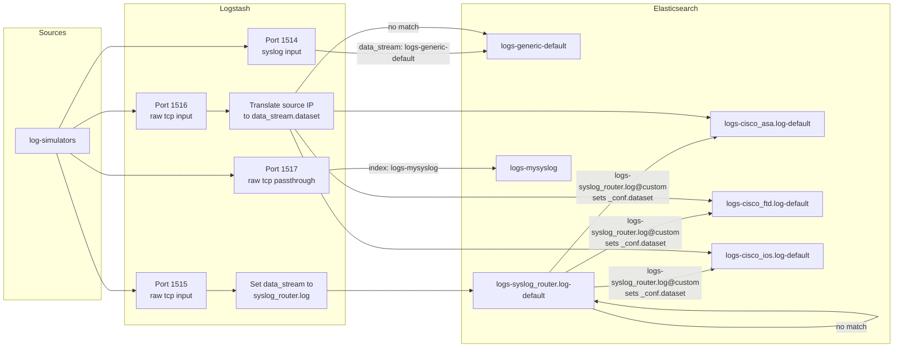
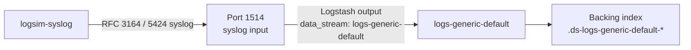
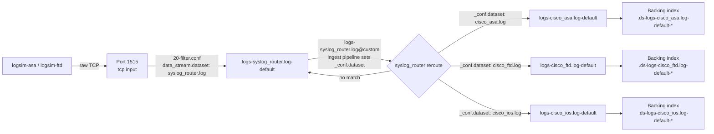
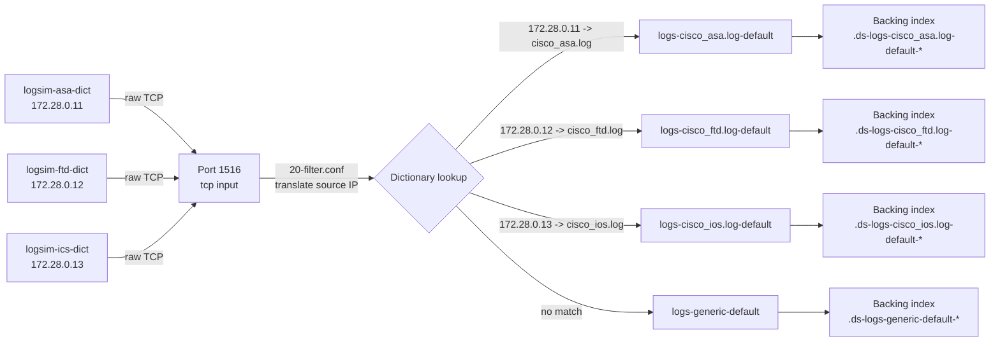

# Standalone Logstash + Elasticsearch + Kibana for testing syslog routing

Run a minimal Elastic stack locally in Docker: Elasticsearch, Logstash and Kibana, with Logstash configured to send syslog input to Elasticsearch.

This project demonstrates **four different approaches to ingesting flavoured syslog data**, each exposed on its own TCP input:

1. **Plain syslog ingestion** — port `1514`. A standard `syslog` input that writes all events to the generic `logs-generic-default` data stream without identifying the source type.
2. **Content-based routing with `syslog_router`** — port `1515`. A raw `tcp` input that forwards events to the `syslog_router` integration data stream. An Elasticsearch ingest pipeline inspects the message contents (for patterns such as `%ASA-`, `%FTD-` or Cisco IOS identifiers) and reroutes matching events to the appropriate Cisco integration data stream.
3. **Source-IP dictionary routing** — port `1516`. A raw `tcp` input that uses a Logstash `translate` filter to look up the sender's IP address in `config/ip_to_integration.csv`. The lookup result sets the target integration data stream; unmatched events fall back to `logs-generic-default`.
4. **Raw syslog passthrough** — port `1517`. A raw `tcp` input that writes the complete, unmodified syslog line to the `logs-mysyslog` index as the `message` field. No parsing or routing is applied.

The more sophisticated approaches (ports `1515` and `1516`) **identify the data type** from the incoming event — either from message content or from source address — and **route the event to the matching Elastic integration data stream** so it is parsed and indexed with the correct schema.

This is a local-development setup only, based on Elastic's [`start-local`](https://www.elastic.co/docs/deploy-manage/deploy/self-managed/local-development-installation-quickstart) quickstart.

## Requirements

- Docker Engine or Docker Desktop
- Docker Compose v2 (`docker-compose`)
- [Task](https://taskfile.dev/) (`mise install` or `mise use task`)
- [uv](https://docs.astral.sh/uv/) (managed by mise)

All dependencies are managed with mise via `mise.toml`.

## Initial setup

```sh
mise install    # install docker-cli, docker-compose, task, uv, etc.
task setup      # creates .env from .env.example
```

Edit `.env` and set secure passwords for `ELASTIC_PASSWORD` and `KIBANA_PASSWORD`. The example file uses `changeme`. `KIBANA_ENCRYPTION_KEY` must be at least 32 characters.

## Start the stack

```sh
task start
```

This starts Elasticsearch, then Kibana, and finally Logstash once Elasticsearch is healthy.

If you want to route events to the Cisco integration data streams via `syslog_router` (port `1515`) or the source-IP dictionary (port `1516`), install the Elastic integration packages first:

```sh
task install-integrations
```

Endpoints:
- Elasticsearch: `http://localhost:9200`
- Kibana: `http://localhost:5601`
- Logstash monitoring API: `http://localhost:9600`

The stack exposes four syslog inputs:

- Port `1514` — `syslog` input for plain syslog (written to `logs-generic-default`).
- Port `1515` — raw `tcp` input tagged for the `syslog_router` integration; the Elasticsearch `logs-syslog_router.log@custom` ingest pipeline routes Cisco ASA/FTD/IOS events to the correct integration data stream.
- Port `1516` — raw `tcp` input for source-IP-based routing using the dictionary file `config/ip_to_integration.csv`. Matched events are written to the corresponding integration data stream; unmatched events fall back to `logs-generic-default`.
- Port `1517` — raw `tcp` passthrough input. The complete syslog line is stored unchanged in the `message` field and written to the `logs-mysyslog` index.

## Data flows



### Port 1514 — plain syslog



### Port 1515 — syslog_router content-based routing



### Port 1516 — source-IP dictionary routing



### Port 1517 — raw syslog passthrough


A data stream in Elasticsearch is a logical collection of backing indices. Each integration data stream is associated with an index template and one or more ingest pipelines; the `@custom` pipeline runs before the integration's default package pipeline and is the extension point used here to classify and reroute events.

Tail the logs:

```sh
task logs
```

Stop the stack:

```sh
task stop
```

## Test the pipeline

Send a single test syslog line:

```sh
task send
```

Run a smoke test that starts the stack, sends a test syslog event, and stops:

```sh
task smoke
```

Send a test line to the raw passthrough port `1517`:

```sh
task send-mysyslog
```

Run a full smoke test for port `1517` that sends an event and queries the `logs-mysyslog` index:

```sh
task smoke-mysyslog
```

## Stream log simulator data

The [log-simulators](https://github.com/matthew-hollick/log-simulators) repo can stream realistic syslog into Logstash on TCP port `1514` (plain syslog) or `1515` (syslog-router tagged events for integration routing).

```sh
LOGSIM_DURATION=10s task logsim-asa       # Cisco ASA firewall syslog
LOGSIM_DURATION=10s task logsim-ftd       # Cisco FTD security syslog
LOGSIM_DURATION=10s task logsim-syslog    # Linux syslog
LOGSIM_DURATION=10s task logsim-mysyslog  # Linux syslog to logs-mysyslog
```

To exercise the source-IP dictionary route on port `1516`, run the simulators in ephemeral Docker containers attached to the dedicated `logsim` network. Each container is assigned a fixed IP that maps to a different integration in `config/ip_to_integration.csv`:

```sh
LOGSIM_DURATION=10s task logsim-asa-dict  # source 172.28.0.11 -> cisco_asa.log
LOGSIM_DURATION=10s task logsim-ftd-dict  # source 172.28.0.12 -> cisco_ftd.log
LOGSIM_DURATION=10s task logsim-ics-dict  # source 172.28.0.13 -> cisco_ios.log
```

These tasks start the stack and wait for Elasticsearch and Logstash to be ready before streaming. The default rate is 10 events/sec and the default duration is 30s.

### Running simulators concurrently and continuously

Start the environment once, then run as many simulators as you want in separate terminal windows. Each task will stream until its duration expires, so the simulators run concurrently:

```sh
# terminal 1 - start the stack
mise install
task setup   # creates .env; set secure passwords before the next step
task install-integrations
task start
task wait

# terminal 2 - plain syslog
LOGSIM_DURATION=5m task logsim-syslog

# terminal 3 - syslog_router content routing
LOGSIM_DURATION=5m task logsim-asa

# terminal 4 - dictionary source-IP routing
LOGSIM_DURATION=5m task logsim-asa-dict
```

To run a simulator indefinitely, set a very long duration:

```sh
LOGSIM_DURATION=999h task logsim-asa
```

You can override the rate and duration:

```sh
LOGSIM_RATE=50 LOGSIM_DURATION=5m task logsim-asa
```

## Install integration packages

Before routing events to the Cisco integration data streams, install the required packages into Kibana:

```sh
task install-integrations
```

This installs the `tcp`, `syslog_router`, `cisco_asa`, `cisco_ios`, and `cisco_ftd` integration packages, and also installs the `logs-syslog_router.log@custom` ingest pipeline that performs the Cisco syslog routing in Elasticsearch.

## Use a custom pipeline

Edit or add `.conf` files under `pipeline/`. Logstash checks for pipeline changes every three seconds and reloads them automatically. All files in the directory are combined into the main pipeline in lexical order:

- `01-input.conf` — syslog input on port `1514` and raw TCP inputs on ports `1515`, `1516`, and `1517`
- `20-filter.conf` — adds `syslog_router` data_stream fields and performs source-IP dictionary lookup for port `1516` events
- `99-output.conf` — Elasticsearch output; events from port `1517` are written to the `logs-mysyslog` index

To load pipeline files from another directory, set `PIPELINE_DIR` to an absolute path:

```sh
PIPELINE_DIR=/absolute/path/to/pipelines task start
```

Validate the selected pipeline without starting the stack:

```sh
task validate
```

## Common tasks

| Task | Description |
| --- | --- |
| `task setup` | Create `.env` from `.env.example` |
| `task start` | Start Elasticsearch and Logstash |
| `task stop` | Stop and remove the containers |
| `task restart` | Restart the stack |
| `task logs` | Tail container logs |
| `task status` | Show running container status |
| `task wait` | Wait until Logstash is ready |
| `task send` | Send a test syslog line to the TCP input |
| `task validate` | Validate pipeline configuration without starting the stack |
| `task smoke` | Start, send a test syslog event, stop |
| `task send-mysyslog` | Send a test syslog line to the passthrough port `1517` |
| `task check-mysyslog` | Query Elasticsearch for recent documents in `logs-mysyslog` |
| `task smoke-mysyslog` | Start, send a passthrough event, query the index, stop |
| `task logsim-asa` | Stream Cisco ASA syslog into Logstash |
| `task logsim-ftd` | Stream Cisco FTD syslog into Logstash |
| `task logsim-syslog` | Stream Linux syslog into Logstash |
| `task logsim-mysyslog` | Stream Linux syslog into the port-1517 passthrough index `logs-mysyslog` |
| `task logsim-asa-dict` | Stream Cisco ASA syslog into the dictionary-routed port from a fixed Docker IP |
| `task logsim-ftd-dict` | Stream Cisco FTD syslog into the dictionary-routed port from a fixed Docker IP |
| `task logsim-ics-dict` | Stream Cisco IOS syslog into the dictionary-routed port from a fixed Docker IP |
| `task install-integrations` | Install Elastic integration packages and the syslog_router routing pipeline |
| `task exec` | Open an interactive shell inside the running Logstash container |
| `task clean` | Remove containers, networks, and volumes |

## Configuration

Environment variables are read from `.env` automatically by Docker Compose. They can be overridden in the shell before running `task`:

| Variable | Default | Purpose |
| --- | --- | --- |
| `ELASTIC_VERSION` | `9.5.3` | Version tag for all Elastic images |
| `ELASTIC_PASSWORD` | `changeme` (required) | `elastic` superuser password |
| `KIBANA_PASSWORD` | `changeme` (required) | `kibana_system` user password |
| `KIBANA_ENCRYPTION_KEY` | `changeme-change-me-...` (required) | Saved objects encryption key, >= 32 chars |
| `ES_JAVA_OPTS` | `-Xms128m -Xmx2g` | Elasticsearch JVM options |
| `LS_JAVA_OPTS` | `-Xms512m -Xmx512m` | Logstash JVM options |
| `ES_PORT` | `9200` | Host port for Elasticsearch |
| `KIBANA_PORT` | `5601` | Host port for Kibana |
| `SYSLOG_TIMEZONE` | `UTC` | Timezone used when generating syslog timestamps in tasks and pipelines |
| `LOGSTASH_SYSLOG_PORT` | `1514` | Host port for the plain syslog TCP input |
| `LOGSTASH_SYSLOG_ROUTER_PORT` | `1515` | Host port for the syslog-router tagged TCP input |
| `LOGSTASH_SYSLOG_DICT_PORT` | `1516` | Host port for the source-IP dictionary-routed TCP input |
| `LOGSTASH_MYSYSLOG_PORT` | `1517` | Host port for the raw syslog passthrough TCP input |
| `LOGSTASH_API_PORT` | `9600` | Host port for the Logstash monitoring API |
| `PIPELINE_DIR` | `./pipeline` | Host directory containing pipeline `.conf` files |
| `LOGSIM` | `git+https://github.com/matthew-hollick/log-simulators` | Git URL for log-simulators |
| `LOGSIM_RATE` | `10` | Average events per second for simulator tasks |
| `LOGSIM_DURATION` | `30s` | How long simulator tasks run |

Port `1514` is used for syslog instead of the standard `514` so Logstash does not need root privileges inside the container. Point simulators at `tcp://127.0.0.1:1514`.

The pipeline in `pipeline/*.conf` sends events to the `elastic` user at `http://elasticsearch:9200`. Events received on port `1515` are tagged for the `syslog_router` data stream; the `logs-syslog_router.log@custom` ingest pipeline inspects the message content and sets `_conf.dataset` so the syslog_router integration reroutes Cisco ASA/FTD/IOS events to the correct data stream. Events that do not match any pattern remain in the `logs-syslog_router.log-default` catch-all data stream.

Events received on port `1516` are routed by the sender's source IP using `config/ip_to_integration.csv`. The Logstash `tcp` input stores the source address in `[@metadata][input][tcp][source][ip]` when ECS compatibility is enabled, and the `translate` filter looks it up. Matched events are written to the corresponding integration data stream and unmatched events fall through to `logs-generic-default`.

Events received on port `1517` are written directly to the `logs-mysyslog` index without parsing or routing. The complete syslog line is preserved in the `message` field.

> **Note:** When Logstash is running inside Docker with published ports, Docker rewrites the source IP of incoming connections to the gateway address of the Docker network. The `logsim-*-dict` tasks avoid this by running simulators in ephemeral containers attached to the dedicated `logsim` Docker network, each with a fixed IP that the dictionary recognises.

## Security notes

This is a local development stack. Elasticsearch has security enabled and requires the `ELASTIC_PASSWORD`. Do not commit `.env` or pipeline files containing credentials. `.env` is already ignored by `.gitignore`.
